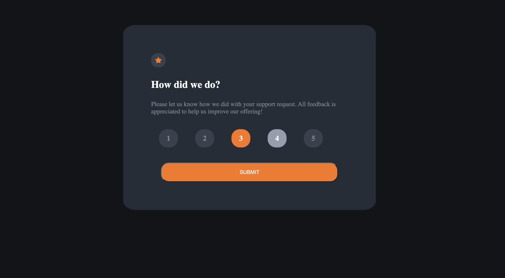

# Frontend Mentor - Interactive rating component solution

This is a solution to the [Interactive rating component challenge on Frontend Mentor](https://www.frontendmentor.io/challenges/interactive-rating-component-koxpeBUmI). Frontend Mentor challenges help you improve your coding skills by building realistic projects. 

## Table of contents

- [Overview](#overview)
  - [The challenge](#the-challenge)
  - [Screenshot](#screenshot)
  - [Links](#links)
- [My process](#my-process)
  - [Built with](#built-with)
  - [What I learned](#what-i-learned)
  - [Continued development](#continued-development)
  


## Overview

### The challenge

Users should be able to:

- View the optimal layout for the app depending on their device's screen size
- See hover states for all interactive elements on the page
- Select and submit a number rating
- See the "Thank you" card state after submitting a rating

### Screenshot




### Links

- Solution URL: [Add solution URL here](https://your-solution-url.com)
- Live Site URL: [Add live site URL here](https://your-live-site-url.com)

## My process

### Built with

- Semantic HTML5 markup
- CSS custom properties
- JavaScript


### What I learned

In this one, I was able to power through the HTML and CSS but JS part took a while. The biggest challenge for me was getting the value of the rating that was clicked so that it can be presented to the last section where it says "thanks for giving us X out of 5 rating". Other part that was challenging was how to see if a rating has been chosen so that submit button can be allowed to work.
I was able to get the number value of the rating by using parseInt() to make sure the value was a number and used thaat number to make sure it is higher than 0 to see if a number has been chosen.

```html
<h1>Some HTML code I'm proud of</h1>
```

```js
//if submit is clicked, check and see if one one of the rating has been clicked
const submitButton= document.querySelector(".submit");
submitButton.addEventListener("click", function(){
        if(answer== 0){
            console.log(answer);
         //and show the next page   
        }else if(answer !=0){
            firstBox.classList.add("survey");
            secondBox.classList.toggle("thank-you")
            //on the next page, input the value of the rating that has clicked value in the text box
            submittedRating.innerHTML="You selected " + answer +" out of 5"
        }
    })

```


### Continued development

I'm going to do few more frontmentor projects to get a good feel for JavaScript so that I can move to the next things.

